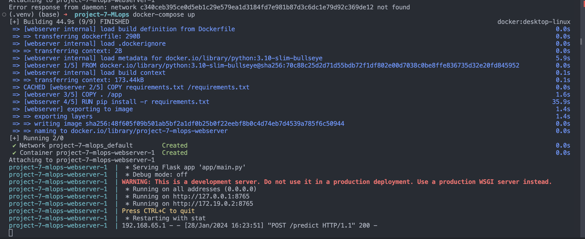
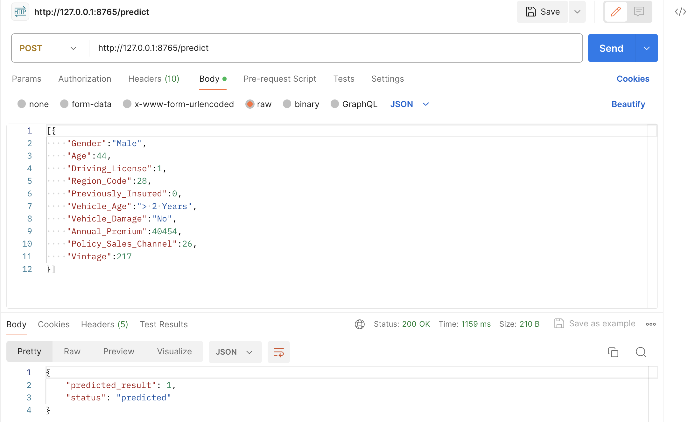
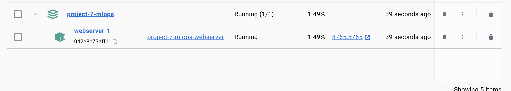
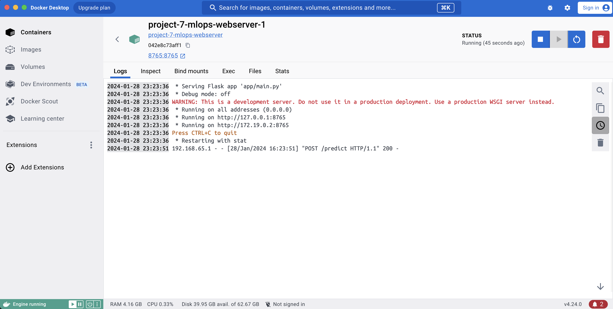

# project-7-MLops

### Running Program on docker-compose

_Picture 1: docker-compose_

### Hit Prediction

_Picture 2: Prediction_

### Check Docker Running on Docker Client

_Picture 3: docker UI_

### Check Log Container

_Picture 4: container_# project-7-MLops
